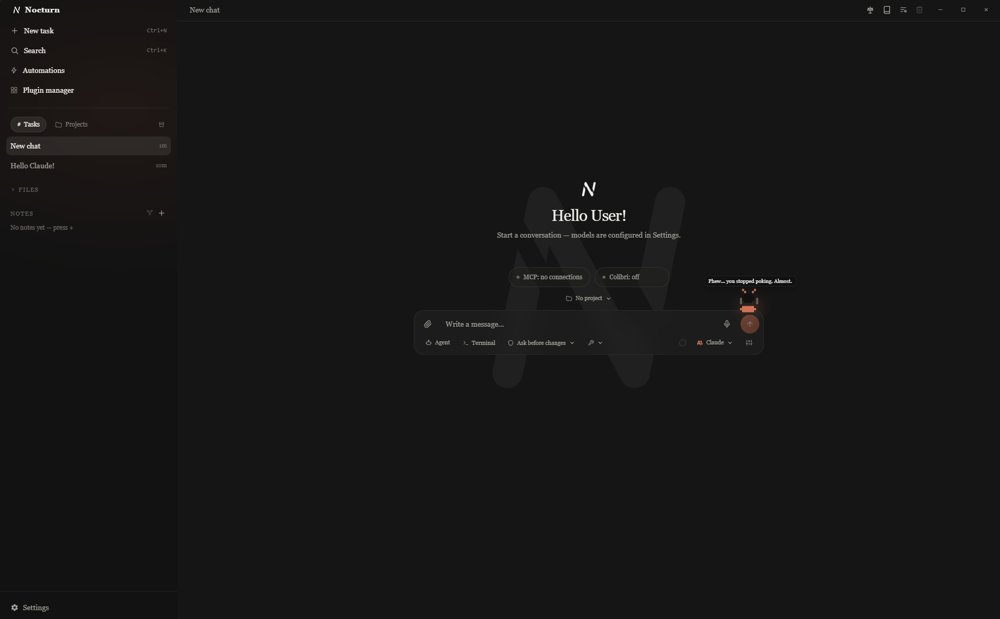
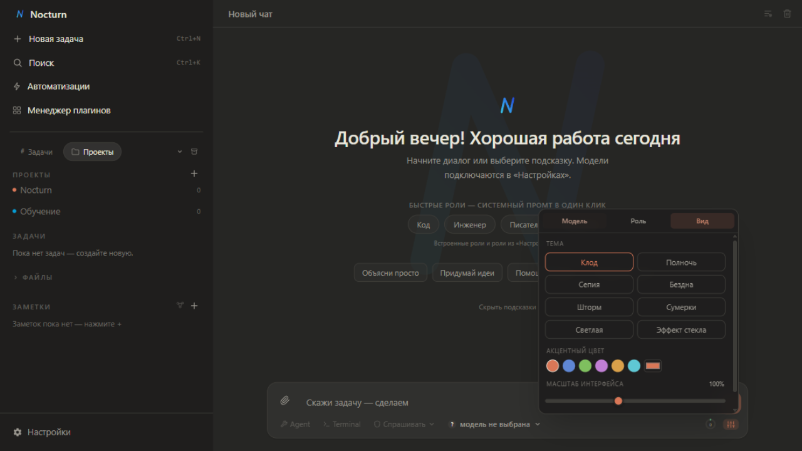
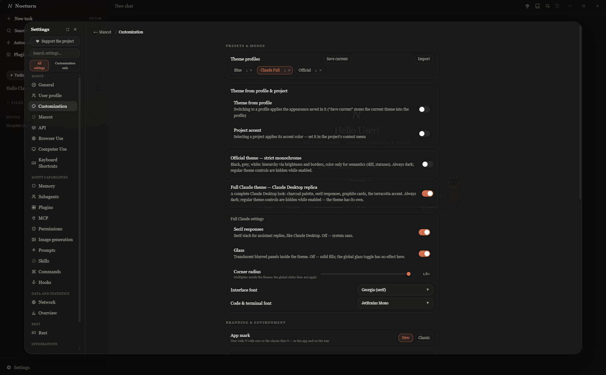
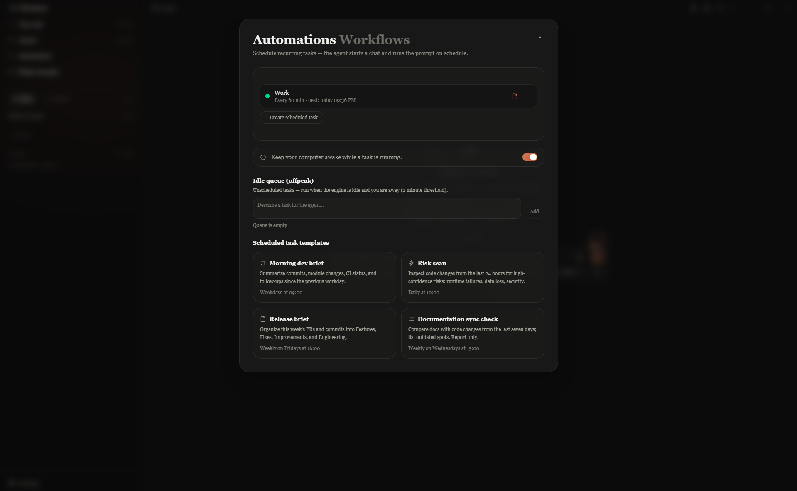

# Nocturn

<p align="center">
  
</p>

**Nocturn** is a local-first, BYOK (**Bring Your Own Key**) AI client for Windows.
Your API key, your provider, your machine — no accounts, no telemetry, no backend
of its own. Built with **Tauri 2** (native binary) + **React 19 + TypeScript** + Tailwind CSS 4.

**Light by design:** the installer is ~4.4 MB. It idles at **~100 MB RAM**
(app + WebView2, per Task Manager); heavy agent runs with large tool outputs
climb to ~200–300 MB — the agent's own headless browser is a separate process
on top of that. No background services.

> Интерфейс на русском и английском (плюс 中文 / 日本語). Основной язык разработки — TypeScript, нативная часть — Rust.
> Журнал изменений — [UPDATE.md](UPDATE.md) (на русском, ведётся с самого первого коммита).

## Why Nocturn

Most AI desktop apps force a trade-off: hosted clients (Claude Desktop, ChatGPT
desktop) are polished but require registration and route everything through
someone's server; BYOK clients (Chatbox, Cherry Studio, Fabric) respect your key
but stay at the plain-chat level. Nocturn is the missing middle ground:

- **Full anonymity** — no account, no email, no sign-up, no telemetry. The app
  talks only to the API endpoint you configure. First run is: paste your key, go.
- **Claude-Desktop-level features, locally** — an agent with file, shell, PTY,
  browser, computer-use and Python tools; permission modes; subagents; memory;
  checkpoints; MCP (local and remote); hooks; scheduled automations; local RAG;
  voice input and output — all running on your machine against your key.
- **Provider-agnostic** — any OpenAI-compatible endpoint plus native Anthropic,
  with a fallback model per profile; switch providers mid-project without losing
  history. Compare up to three providers side-by-side on one prompt.
- **Light and local-first** — ~4.4 MB installer, ~100 MB idle RAM, everything
  (chats, projects, notes, knowledge bases, memory) stored on your disk in
  plain, inspectable JSON/markdown/SQLite.
- **Safety rails built in** — permission modes, per-task command allowlists,
  sensitive-path guards and hard token/cost budgets with automatic run abortion.

## Features

### Chat & agent

- **Streaming chat** with any OpenAI-compatible provider or native Anthropic;
  markdown, syntax highlighting, **Mermaid diagrams**, citation of any tool
  result, quote-into-composer by selection.
- **Agent mode** with tools: files (read/write/grep/list), shell, live **PTY
  terminal**, **Browser Use** via CDP (navigate, read, screenshot, click — with
  a live view panel), **Computer Use** (screen capture, mouse, keyboard),
  image generation, and **Code Interpreter** — Python 3 via Pyodide (WASM) in a
  sandboxed worker: no disk, no IPC, stdout/stderr go back to the model.
- **Permission modes** (Plan / Ask / Edit / Full), per-task command allowlists
  with "always for this task" memory, and **plan approval** panel in Plan mode.
- **Edit & resend with branching** — editing any message forks a new session;
  the original stays intact and one click returns you to it.
- **Subagents** — parallel role-based workers (researcher / coder / critic /
  librarian) with a live monitor next to the send button.
- **Memory** — persistent facts the agent saves and recalls itself
  (`memory_save` / `memory_recall`); review, edit or wipe them in settings.
- **Project rules** — an `AGENTS.md` / `CLAUDE.md` in the project root is
  automatically injected into the agent's context.
- **Checkpoints & rollback** — automatic snapshots before agent edits, restore
  any state in one click; optional **git auto-commit** before edits.

### Knowledge

- **Knowledge bases (RAG)** — index your documents (markdown, code, logs, CSV…)
  into a local SQLite FTS5 index and attach a base to a chat: relevant snippets
  are injected into context automatically. Chunking, search and storage are
  fully local — no embedding APIs, nothing leaves the machine.
- **Vault** — markdown notes with `[[wiki links]]`, a visual knowledge graph,
  and vault tools the agent can read, write and search.

### Voice & media

- **Media mini-bar** — a slim bar over the chat that follows the OS player
  (Spotify desktop, browser tabs): track, elapsed time, pause and track
  switching via the system media controls — no accounts, no cloud. Optional
  synced lyrics from lrclib.net (explicit opt-in: only the track title and
  artist are looked up), auto-follow highlight in theme accent or a custom
  color.
- **Dictation** — push-to-talk via a local whisper.cpp (the model downloads on
  first use, microphone is selectable).
- **Voice Wake (Jarvis mode)** — optional always-on local wake word
  (openWakeWord, fully offline): say "Hey Jarvis" and dictate a task
  hands-free. Audio never leaves the machine.
- **Read-aloud** — answers spoken by local Windows SAPI voices, ru/en
  auto-selected. No cloud speech anywhere.
- **Image generation** — an optional `image_generate` agent tool via your own
  image API (off by default).

### Automation & integration

- **Integrations tab** — a dedicated settings tab for local integrations,
  gated by a one-time transparency warning: everything runs through WinAPI
  on your machine. **Spotify** (desktop client via OS media controls +
  window-title fallback) and **YouTube** (official `youtube-nocookie` embed:
  paste a link, queue, collapsible popup player feeding the same mini-bar)
  are mutually exclusive — one active integration at a time. Telegram is
  planned.
- **Automations** — scheduled tasks (daily / weekdays / weekly / interval): the
  agent starts a chat and runs the prompt on schedule; optional keep-awake.
- **MCP** — external Model Context Protocol servers over **stdio and remote
  HTTP** (streamable, with auth headers); tools merge into the agent
  automatically.
- **Hooks** — shell commands on PreToolUse / PostToolUse / UserPromptSubmit /
  Stop / SessionStart; can block or enrich agent actions.
- **Web search** — an optional `web_search` tool via SearXNG (self-hosted) or
  Brave; pairs with the browser tools for reading full pages.
- **Plugins & packs** — a plugin system with roles, prompts, skills and packs
  (hooks/MCP bundles) you can import and export as one file.
- **Quick Entry** — a global-hotkey floating input that drops a task into
  Nocturn from anywhere (X11 and Wayland via the GlobalShortcuts portal).
- **Import** — bring history from ChatGPT and Gemini exports.

### Data & safety

- **Hard Limits** — per-task budgets (tokens, $/1M tokens, $ total) with
  automatic run abortion.
- **Usage overview & Reflect** — local statistics: token activity heatmap,
  daily trend, per-model usage; a one-shot model "reflection" over your local
  summary, savable as a note.
- **Crypto vault** — optional AES-256-GCM encryption of API keys with a master
  password; the vault auto-locks after 15 minutes of inactivity.
- **Artifacts** — any ```html block in an answer gets a one-click **sandboxed
  preview** (iframe without same-origin: scripts run, your data stays sealed).
- **Hard Mode** (experimental) — Nocturn hides away and the window becomes a
  full-screen live PTY terminal (xterm.js) wired to your shell; exit by hotkey.

## Settings: deeper than it looks

Nocturn keeps its power in settings rather than in your face:

- **20+ sections in 6 groups** — Основное / Профиль / Кастомизация / API /
  Browser Use / Computer Use / Горячие клавиши · Память / Субагенты / Плагины /
  MCP / Изображения / Промпты / Скиллы / Команды / Хуки · Сеть / Обзор · Отдых ·
  Справка — plus standalone surfaces (knowledge bases, knowledge graph,
  automations, model comparison, usage statistics, storage manager).
- **Dozens of settings in Customization alone**: 12 dark theme styles + light +
  **Official**
  monochrome (with OLED and contrast options), 6 accent presets +
  custom color + per-project accent, glass effects with a blur slider,
  ambient backgrounds, wallpapers, UI scale, radius, message scale, motion
  speed, smooth streaming with adjustable print speed, fonts for UI / code /
  terminal (including local font import), custom CSS, terminal shell and
  palette, app mark, **theme profiles** — and mini-games (2048, Minesweeper,
  Snake) in the "Отдых" tab for good measure.
- **Search across all settings** — type a few letters, jump to the exact
  section with the item highlighted.

## Screenshots

<p align="center">
  
  
</p>
<p align="center">
  
</p>

## Themes

Two looks, one toggle — **Settings → Customization**. The theme applies
instantly and is remembered.

| Theme | What it is |
|---|---|
| **Halo** (default) | Warm dark palette in the spirit of Claude: 12 dark styles + light, 6 accent presets + custom color, glass effects, theme profiles. |
| **Official** | Strict black / grey / white monochrome in the Linear-Vercel spirit. Hierarchy comes from brightness and borders, color is reserved for semantics — diffs, tool statuses, errors. Extras: true-black OLED background, higher-contrast mode, greyscale code highlighting. Always dark, opt-in. |

Ambient backgrounds come in two flavours: the CSS "breathing accent" glow, or
procedural canvas scenes — fog, snowfall, neon city, starfield, gradient — and
your own looped video. All scenes are **theme-aware**: they are painted from
the live palette and re-tint instantly when you switch themes or accents.

> **A note on ambient video backgrounds:** a looping video behind the chat
> looks great, but the decoder keeps using GPU/battery while it plays.
> Playback pauses automatically while the agent is streaming and when the
> window is minimized, yet on battery-powered laptops the procedural scenes
> are the friendlier choice. Keep custom clips short (~50 MB) and dim — the
> app adds a dark overlay on top for text readability.

## Privacy & Security

Nocturn never sends anything anywhere except the API provider **you** configured.
Prompts, files and tool results go straight to your endpoint; there is no
analytics, no crash reporting, no phone-home. Concretely:

- **Chats, notes, projects, memory** live on your disk in plain, inspectable
  JSON/markdown.
- **API keys** can be encrypted with a master password (AES-256-GCM + Argon2id);
  an encrypted vault auto-locks after 15 minutes of inactivity.
- **Knowledge bases** are indexed into a local SQLite file; search runs entirely
  on this machine (no embedding APIs).
- **Code Interpreter** runs Python in a WASM worker with no disk or IPC access;
  **Artifacts** render in a sandboxed iframe without same-origin.
- **Dictation and read-aloud** run through local processes (whisper.cpp / Windows
  SAPI) — audio and text never leave the computer.
- **The agent layer** is hardened by regular deep-audit passes (permission
  checks, sensitive-path guards, command allowlists, tool-output handling) —
  see [SECURITY.md](SECURITY.md) for the full breakdown of what is stored and
  what leaves the machine, including known trade-offs.

## Getting started

```bash
npm install          # once
npm run tauri dev    # native window (first Rust build takes a few minutes)
npm run dev          # quick browser preview without Tauri
npm run build        # frontend build (tsc + vite)
```

Requirements: **Node 20+** and **Rust** (for the native build).

Windows, Linux and macOS builds are produced automatically for every release —
grab an installer from
[Releases](https://github.com/nocturn-lab/Nocturn-AI/releases). Notes per
platform:

- **Windows** — the most tested platform.
- **macOS** — builds are unsigned; on first launch right-click the app →
  *Open*, or allow it in System Settings → Privacy & Security.
- **Linux** — use the `.AppImage` for automatic in-app updates (`.deb` updates
  manually); Computer Use (screen capture / input) requires an **X11** session;
  Quick Entry global hotkey works on Wayland via the GlobalShortcuts portal.

## Project layout

```
src/            React frontend (App, ChatArea, Sidebar, SettingsModal, …)
src-tauri/      Rust side: agent tools, MCP, browser (CDP), PTY, crypto,
                hooks, knowledge bases, dictation, memory
src/locales/    ru / en / zh / ja dictionaries (compiler-checked)
docs/           screenshots, internal dev notes
.github/        CI: frontend build + cargo tests on Windows/Linux/macOS
```

## Changelog

Every change — features, fixes, refactors — is logged in
[UPDATE.md](UPDATE.md) with commit hashes, newest first.

## Contributing

Issues and PRs are welcome. `npm run lint`, `npm test`, `npm run build` and
`cargo clippy --all-targets -- -D warnings` / `cargo test` (in `src-tauri/`)
must pass — CI enforces all of them. Internal development notes live in
[docs/internal/SESSION_NOTES.md](docs/internal/SESSION_NOTES.md), working
conventions in [AGENTS.md](AGENTS.md).

## License

[MIT](LICENSE)
